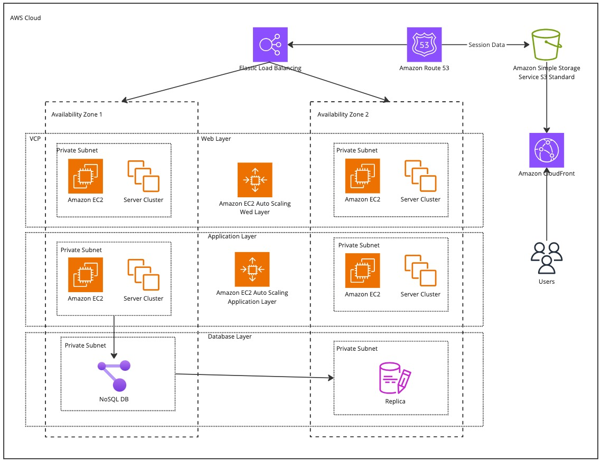
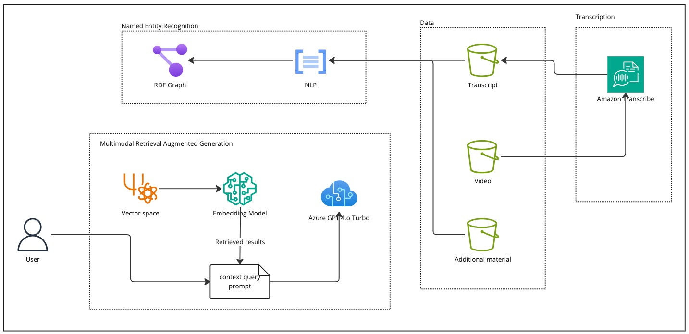

# Context Augmented Research Assistant 
This is implementation of a virtual assistant based on AV recordings like meetings. 

## Solution Architecture
When building an application it is important to think about scalability, availability and resilience of the solution, even for PoCs.  

This is the high level solution architecture that ensures that the solution is fault-tolerant, resilient, highly-available and achieve redundancy. 

### A Robust and Scalable Application Architecture

This architecture diagram illustrates a well-designed solution, showcasing how various AWS services can be leveraged to create a robust and scalable application.

**Key Components:**

* **Elastic Load Balancing:** Incoming traffic is automatically distributed across multiple availability zones, such as AWS EC2 instances, containers, or IP addresses. This ensures high availability and fault tolerance.

* **Application Layers:** The application is typically structured with three layers:
* **Web Layer:** This layer handles user requests and presents the front-end interface. Autoscaling ensures the web layer can adapt to dynamic content and workload fluctuations. It automatically scales out (adds instances) or scales in (removes instances) based on predefined criteria, such as CPU utilization, to meet traffic demand and maintain application performance.
* **Application Layer:** This layer contains the business logic of the application and also utilizes autoscaling for optimal performance.
* **Database Layer:** Data is stored in a NoSQL database for efficient scalability. This setup includes a primary database and replicas, which are particularly useful for managing read-heavy operations, improving performance and reducing load on primary instances.

* **NoSQL Database:** NoSQL databases are designed for horizontal scaling, utilizing distributed clusters of cost-effective hardware. This approach enhances throughput while minimizing latency.

* **Amazon CloudFront:** This Content Delivery Network (CDN) manages the distribution of static content, such as videos and images. By serving content from locations closer to the user, CloudFront reduces loading times and improves user experience.

* **Amazon Route 53:** This Domain Name System (DNS) web service enables reliable and efficient routing of traffic to your application.

**Benefits:**

* **Scalability:** The architecture utilizes auto-scaling for the web and application layers, along with NoSQL databases, to ensure the application can handle fluctuating workloads and accommodate growth.
* **High Availability:** Elastic Load Balancing distributes traffic across multiple availability zones, minimizing downtime in case of failures.
* **Performance Optimization:** The combination of autoscaling, NoSQL databases, and CloudFront optimizes performance by distributing workloads, minimizing latency, and delivering content efficiently.
* **Cost-Effectiveness:** The use of NoSQL databases and distributed clusters allows for cost-efficient scaling, utilizing cost-effective hardware resources.

This architecture diagram provides a foundation for building a reliable, scalable, and performant application using AWS services.

### Gen AI Architecture

## Agentic RAG Implementation 

## Data

## How to run locally 

### Libraries

## Acknowledgement 
